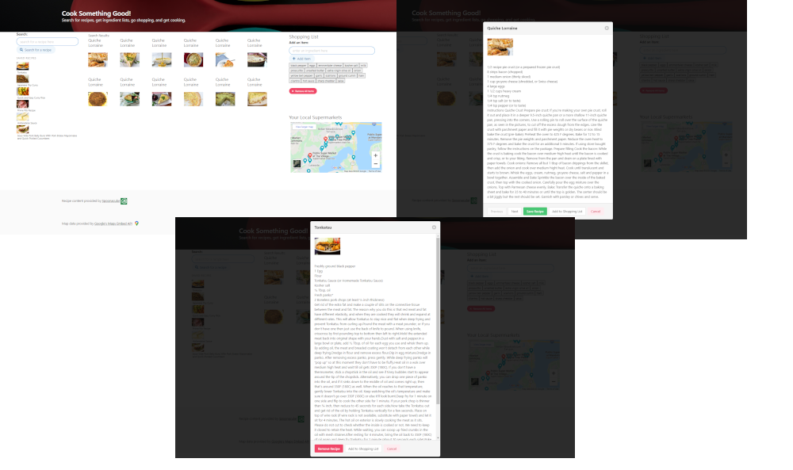

# UCF Project 1
This project is the summation of the interactive front end development section of the University of Central Florida Full Stack Developer Bootcamp.

## Project Description
This application provides an interactive recipe search.  A user can search for recipes or ingredients and they are provided with a set of tiles displaying the search results. When they select a result, a modal is shown with the recipe details, including the ingredients and instructions, as well as an option to add ingredients to the integrated shopping list and to save the recipe. THe user can switch between recipe results without closing the modal if desired. 

When the user choses to save a recipe, a mini tile is created with the recipe title and a thumbnail picture which is instantiated in a saved recipe list. The user can click on a recipe in the saved recipe list to display the recipe details again, and the user may choose to add ingredients to the shopping list or to remove the recipe from the saved list. 

The shopping list checks for and removes duplicate items and can be edited item by item. Items can also be added via a form entry. The list can easily be cleared using the Remove All Items button.  The saved recipe list and shopping list are saved to local storage.  

The Spoonacular API is used to power the recipe search and ingredient list.

Below the shopping list, there is a section with a map showing grocery stores near to the user. The Google Places API and the geolocation API power this feature. 

The Bulma CSS framework is used for styling.

## Tools Used
* HTML
* CSS
* Bulma
* JavaScript
* jQuery
* Server side and client side Web APIs
* AJAX

## Collaboration
This application was created by Kathleen Pehl, Jonathan Saunders, and Ian Englehart.

## Deployed Application
The application is hosted at: https://kpehl.github.io/ucf-project-1/ 

## Screenshot

